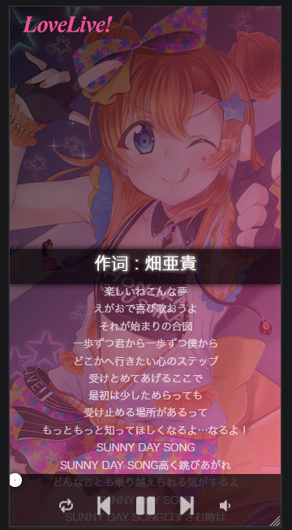
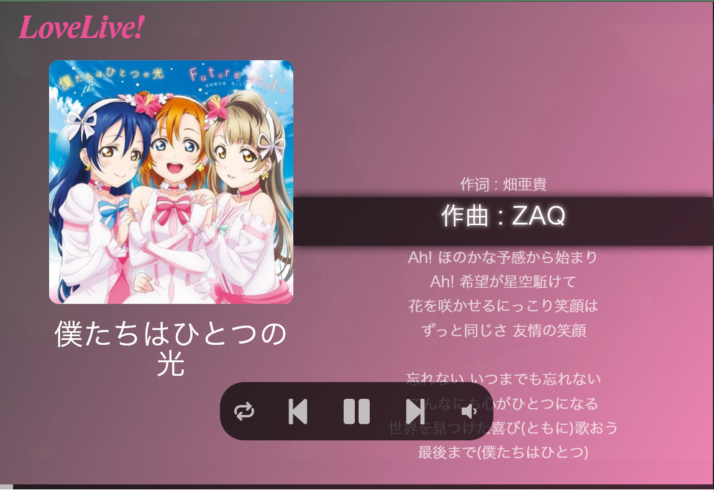
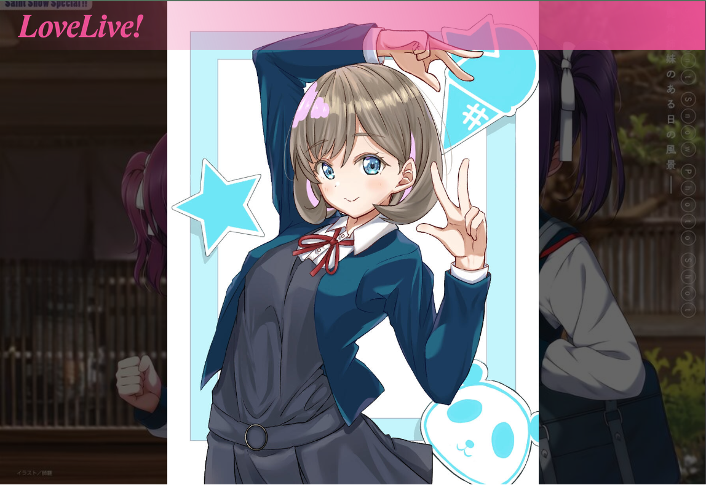
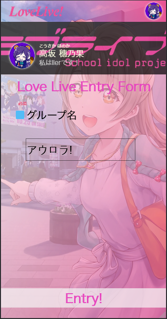

# lll, 
As what you have seen, it is a project for lll.  
  
  
  
  
Love Live Fans Project is both available for pads, displayers and phone. It has closedly auto to change sizes of elements powered by CSS rem unit.
## lll
ll is the shortName of Love Live. In China, we call Love Live Project lovers as "llers". The Name of lll is of my mistake that directly sync my files named from my project folder, and the reason why I do not alter it is I do not like announce anything that I care and love. Only the real lovers can meet with us ~~(currently only myself and one my classmate😅)~~.
***
## How to contribute
In my view, if you have interest in my project, you **CAN** do **ANYThing** you like and pull requests in any aspact. 
### I encourage...
1. Add explanations in my codes
2. Pull requests of bugs or features
3. Start an issue of new features about experiences and ideas about UI
4. Write more in my `songData` list and collect popular or beautiful pictures for the exhibition.
### I do not like...
1. Asking common questions that can be solved by searching
2. yygq[^yygq]
3. Listing wishes from the heaven
***
## About 
The author is called Subkey(子键です), from Shanghai. I am an outgoing man, but I can never get new friends love me.
The project has a feature of learning Japanese. One of my favorite is Nijigen二次元 culture. The most artwork is from Japan, so ganba頑張っ oを watashi私 learning Japanese.
I do not prevent and stop any action about this project, as long as you know what you are just really doing.

[^yygq]: Chinese slang Yin Yang Guai Qi, you can learn it from Internet.